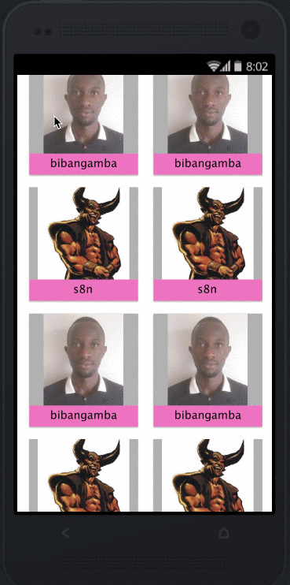

# GitHub Users mobile app

## Introduction
### What does the application do?

* This app is a simple demonstration on how to consume a REST API and showcases how to use a number of [tools](#built-with) provided by the Android team and beyond.
* It consumes the [Github REST API](https://api.github.com/) by showing the `first 40 Java Developers in Kenya`.

### Functionality
* The application has 2 screens i.e. the list of Java developers and the details screen.
* While on the list screen; you can scroll down, change orientation, and the list will retain your scroll position.
* When you click on any card, you are taken to the details screen which show more information about the developer.
* When you click on the share button at the bottom, you get a chooser screen that lets you share the developers github profile through different platforms (SMS, email, etc)

## Getting Started

Below are instructions to get the app good to run on your local machine.

### Prerequisites

* [Android Studio](https://developer.android.com/studio)
* [JDK](https://www.oracle.com/technetwork/java/javase/downloads/jdk8-downloads-2133151.html)
* [Git](https://git-scm.com/)

### Installing

* clone the repo : `git clone https://github.com/bibangamba/GitHubUsers.git` 
* import the project into android studio
* [create an android virtual device (AVD) and start it](https://developer.android.com/studio/run/managing-avds)
* [run the project](https://developer.android.com/training/basics/firstapp/running-app) you've imported above

## Running the tests

* In the terminal, run `./gradlew jacocoTestCoverage` to run tests and generate a coverage report

### Mock ups

### Demo

## Built With

* [Android Java](https://codelabs.developers.google.com/codelabs/build-your-first-android-app/) - Codelab on Java Android
* [Android Studio](https://developer.android.com/studio) - IDE used to build the app
* [Android Data Binding](https://developer.android.com/topic/libraries/data-binding/index.html) - bind UI layout components to data sources in the app
* [Retrofit](https://square.github.io/retrofit/) - for REST API communication
* [Glide](https://github.com/bumptech/glide) - for image loading
* [Espresso](https://google.github.io/android-testing-support-library/docs/espresso/) - for UI tests
* [Invision](https://invisionapp.com) & [Sketch](https://www.sketch.com/) - Mock up design tools

## Rationale for choice of Sketch & Invision as the mock up design tools
1. I found out that the project I would be working on (Converge Mobile) was using Invision for its design mock ups and I wanted to experience using it too.
2. I also found out that creating an interactive mock up was quite easy when using Invision once I had designed the boards in Sketch
3. Sketch as a design tool was easy to use, quite powerful, and has tons of free icons & online support

## Author

*  [**Andrew Twijukye**](https://github.com/bibangamba)

## Acknowledgements
* [Joshua Mugisha](https://github.com/joshNic) for his feedback, advice, and guidance
* [Jamillah Mayombwe](https://github.com/jamiemayombwe) for her mentorship, awesome resources, and enabling me achieve the best results
* [Andela](https://andela.com/) for the awesome learning opportunity & environment
